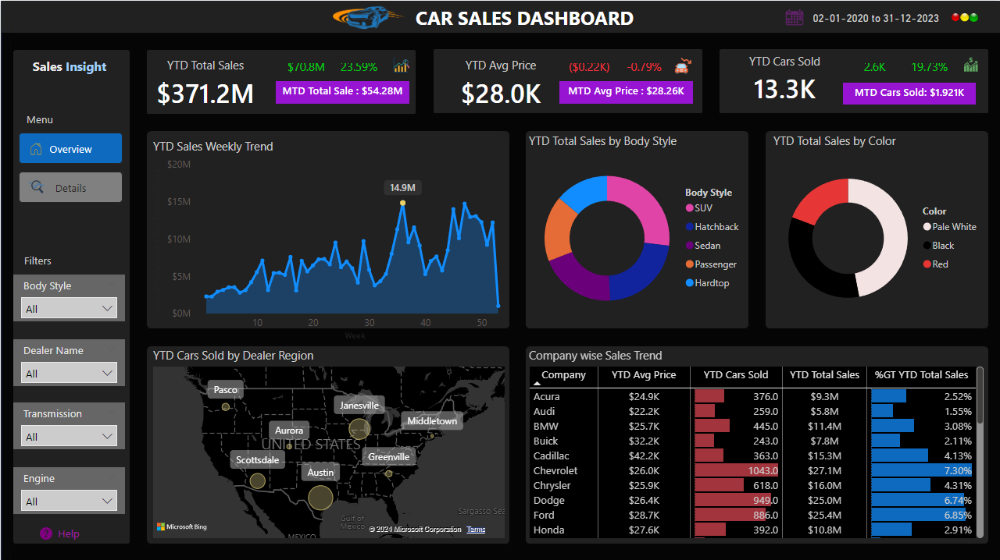
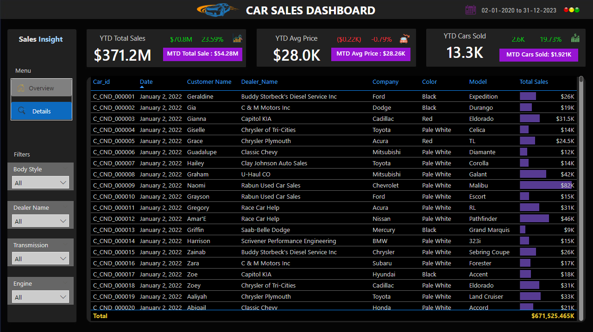

# Car Sales Dashboard in Power BI
---


## Background
---

Our car dealership specializes in selling various car models, and to enhance our sales tracking and analysis, we are embarking on the development of a comprehensive Car Sales Dashboard using Power BI. The objective of this project is to create a dynamic and interactive dashboard that visualizes critical key performance indicators (KPIs) related to our car sales. This will enable us to make data-driven decisions and gain insights into our sales performance over time.
<br>

## Objectives
---

### 1. KPI’s Requirement
   - Provide real-time insights into key performance indicators (KPIs) related to our sales data.
   - Enable informed decision-making, progress monitoring, and identification of trends and growth opportunities.

Some of the measures I created to achieve the KPIs are:

```python
MTD Avg Price KPI = CONCATENATE("MTD Avg Price : ", FORMAT([MTD Avg Price] / 1000, "$0.00K"))
MTD Cars Sold KPI = CONCATENATE("MTD Cars Sold: ", FORMAT([MTD Cars Sold] / 1000, "$0.000K"))
MYD KPI = CONCATENATE("MTD Total Sale : ",FORMAT([MTD Total Sales] / 1000000, "$0.00M"))
```

### 2. Sales Overview
   - Year-to-Date (YTD) Total Sales
   - Month-to-Date (MTD) Total Sales
   - Year-over-Year (YoY) Growth in Total Sales
   - Difference between YTD Sales and Previous Year-to-Date (PTYD) Sales

Some of the measures I created for the YTDs, MTDs, YoYs and PTYDs are:

```python
MTD Total Sales = TOTALMTD(SUM(car_data[Price ($)]), 'Calendar Table'[Date])
PYTD Total Sales = CALCULATE(SUM(car_data[Price ($)]), SAMEPERIODLASTYEAR('Calendar Table'[Date]))
YTD Total Sales = TOTALYTD(SUM(car_data[Price ($)]),'Calendar Table'[Date])
```

### 3. Average Price Analysis
   - YTD Average Price
   - MTD Average Price
   - YOY Growth in Average Price
   - Difference between YTD Average Price and PTYD Average Price

Some of the measures I created for Avg. Price analysis are:

```python
MTD Avg Price = TOTALMTD([Avg price], 'Calendar Table'[Date])
PYTD Avg Price = CALCULATE([Avg price], SAMEPERIODLASTYEAR('Calendar Table'[Date]))
YoY Avg Price Growth = [Avg Price Diff] / [PYTD Avg Price]
YTD Avg Price = TOTALYTD([Avg price], 'Calendar Table'[Date])
```

### 4. Cars Sold Metrics
   - YTD Cars Sold
   - MTD Cars Sold
   - YOY Growth in Cars Sold
   - Difference between YTD Cars Sold and PTYD Cars Sold
   
Some of the measures I created for the Cars sold metrics are:

```python 
MTD Cars Sold = TOTALMTD(COUNT(car_data[Car_id]), 'Calendar Table'[Date])
PYTD Cars Sold = CALCULATE(COUNT(car_data[Car_id]), SAMEPERIODLASTYEAR('Calendar Table'[Date]))
YTD Cars Sold = TOTALYTD(COUNT(car_data[Car_id]), 'Calendar Table'[Date])

Avg Price Diff = [YTD Avg Price] - [PYTD Avg Price]
Cars Sold Diff = [YTD Cars Sold] - [PYTD Cars Sold]
Sales Difference = [YTD Total Sales] - [PYTD Total Sales]
```
<br>

## Problem Statement 2: Charts Requirement
---

### 1. YTD Sales Weekly Trend
   - Display a line chart illustrating the weekly trend of YTD sales.
   - X-axis represents weeks, and Y-axis shows the total sales amount.

### 2. YTD Total Sales by Body Style
   - Visualize the distribution of YTD total sales across different car body styles using a Pie chart.

### 3. YTD Total Sales by Color
   - Present the contribution of various car colors to the YTD total sales through a pie chart.

### 4. YTD Cars Sold by Dealer Region
   - Showcase the YTD sales data based on different dealer regions using a map chart to visualize the sales distribution geographically.

### 5. Company-Wise Sales Trend in Grid Form
   - Provide a tabular grid that displays the sales trend for each company.
   - The grid should showcase the company name along with their YTD sales figures.

### 6. Details Grid Showing All Car Sales Information
   - Create a detailed grid that presents all relevant information for each car sale, including car model, body style, color, sales amount, dealer region, date, etc.

<br>

This project aims to deliver a powerful tool that empowers our team with actionable insights to optimize our sales strategies and drive business growth.

The final dashboard I created is shown below:



<br>

