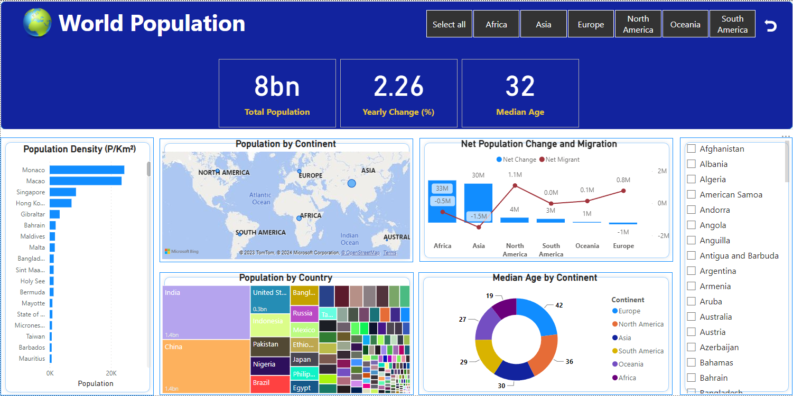

# World Population Dashboard
---
This project presents visualizations of the 2023 world population data using Power BI. The data was obtained through web scraping from reliable and verified websites. The primary goal of this project is to demonstrate to users how web-sourced data can be integrated into Power BI, showcasing the automation of data flows from web sources.
 

## Data Sources
---
You can access the Excel file containing this data from my [GitHub](https://github.com/onisj/PowerBI_Dashboards) repository. Alternatively, if you prefer to , the links are provided below.
⭐ GitHub: [World Population Repository](https://github.com/onisj/PowerBI_Dashboards)

Included in the repository:

- Power BI file
- Excel data file in the data folder
- An Image of the dashboard

The data was extracted from the following websites:
- [Populations](https://www.worldometers.info/world-population/population-by-country/)
- [Continents](https://worldpopulationreview.com/country-rankings/list-of-countries-by-continent)
- [Capital Cities](https://geographyfieldwork.com/WorldCapitalCities.htm) 
 

## Questions to Address
### Key Performance Indicators (KPIs):
1. Total population
2. Yearly population change
3. Median age
4. Urban population

### Questions and Corresponding Charts:
1. __Population Density by Country:__
Display a bar or column chart illustrating the population density (people per square kilometer) for various countries.

2. __Geographical Visualization:__
Present the population by continent.

3. __Population by Country:__
Utilize a treemap to represent the total population and the world population share allocated to each continent.

4. __Migrants' Impact on Population:__
Use a stacked column chart or line chart to compare the net migration effect on population growth.
Results: Migration does not exhibit any significant influence on population growth.

5. __Median Age Distribution:__
Showcase the distribution of median age across different continents using a donut chart.
 

## View of the Dashboard

